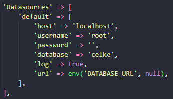
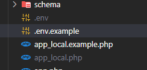

# CakePHP Application
Utilizamos nesse projeto o framework CakePHP, na sua versão 3.9

## Instalação Composer
#### Primeiro baixe o composer (se já estiver instalado na máquina não precisa instalar novamente)
1. Download [Composer](https://getcomposer.org/doc/00-intro.md) or update `composer self-update`.

## Instalação WampServer

#### Você irá precisar de um servidor Apache e o PHP na sua versão 7.4
1. Vá no site do WampServer e baixe-o gratuitamente
(https://www.wampserver.com/en/download-wampserver-64bits/)
2. Depois da instalação, você poderá ver o wampServer nos ícones ocultos na sua barra de navegação do windows rodando em segundo plano.
Você pode tanto clicar com botão esquerdo como o direito para abrir suas configurações, porém, aperte com o botão direito para abrir
as opções de ferramentas. 
Clique no **PHP>Version>Escolha a versão 7.4**

## Variáveis de ambiente

Para que o Windows reconheça globalmente o PHP do Wamp, faça assim>

1. Procure pela pasta do Wamp no seu disco local C (é provavel que esteja escrito wamp64 ou wamp32)
2. Vá em **C:\wamp64\bin\php\php7.4.33**
3. Copie o endereço da pasta php7.4 e coloque nas suas variáveis de ambiente global.

## Clonagem do repositório

Você não precisa instalar o cakephp, apenas clone o repositório e ele virá junto.

Porém, abra os arquivos do Wamp no seu diretório, e visite www, pode apagar tudo que tem ali dentro, menos a pasta www.

Em seguida, clone o seu repositório ali dentro da pasta www.

## Configurações do Banco

A aplicação irá pedir para você configurar um banco de dados, então ponha o seu Wamp para rodar, abra o PhpMyAdmin, crie um banco de dados com a tabela Users.

Porém, já irei deixar junto com os arquivos, um banco de dados para você apenas importar ele para o PhpMyAdmin.

Feito assim, abra o seu VS Code e vá em: ``config/app_local.php`` em seguida procure por **Datasource** na linha 37, e ponha:

## Outras configurações

Ainda dentro de ``config`` você verá 2 arquivos chamados **.env.example** & **app_local.example.php**. Renomeie eles apenas para *app_local.php* e *.env*

## Abrindo sua aplicação

escreva **localhost** na barra de pesquisa do seu navegador e abra a pasta da sua aplicação, que provavelmente está com o nome do repositório ou da pasta que você criou.
